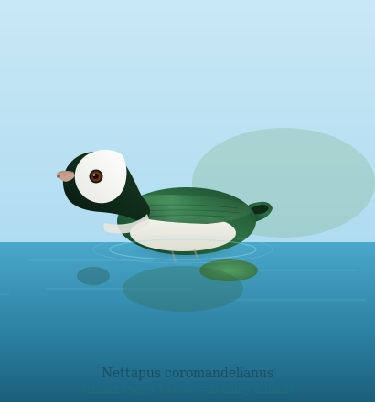

  <picture>
    <source media="(prefers-color-scheme: light)" srcset="logo/indian-pygmy-goose.svg">
    <source media="(prefers-color-scheme: dark)" srcset="logo/indian-pygmy-goose.svg">
    
  </picture>

 

  
  
  

# Pygmy Goose

The Indian Pygmy Goose is the smallest species of Duck on the planet. Yes, it's a Duck although it's called a Goose.

DuckDB is a leading open source project in the realm of columnar databases. It has high quality code and an extensive CI that takes many hours.

For other projects active in the columnar database space, it's appealing to make small libraries out of DuckDB code so it could be reused in our projects.

If you're one of those projects, do get in touch so we can share the maintenance cost.

## DuckDB

DuckDB is a high-performance analytical database system. It is designed to be fast, reliable, portable, and easy to use. DuckDB provides a rich SQL dialect with support far beyond basic SQL. DuckDB supports arbitrary and nested correlated subqueries, window functions, collations, complex types (arrays, structs, maps), and [several extensions designed to make SQL easier to use](https://duckdb.org/docs/stable/sql/dialect/friendly_sql.html).

DuckDB is available as a [standalone CLI application](https://duckdb.org/docs/stable/clients/cli/overview) and has clients for [Python](https://duckdb.org/docs/stable/clients/python/overview), [R](https://duckdb.org/docs/stable/clients/r), [Java](https://duckdb.org/docs/stable/clients/java), [Wasm](https://duckdb.org/docs/stable/clients/wasm/overview), etc., with deep integrations with packages such as [pandas](https://duckdb.org/docs/guides/python/sql_on_pandas) and [dplyr](https://duckdb.org/docs/stable/clients/r#duckplyr-dplyr-api).

For more information on using DuckDB, please refer to the [DuckDB documentation](https://duckdb.org/docs/stable/).
